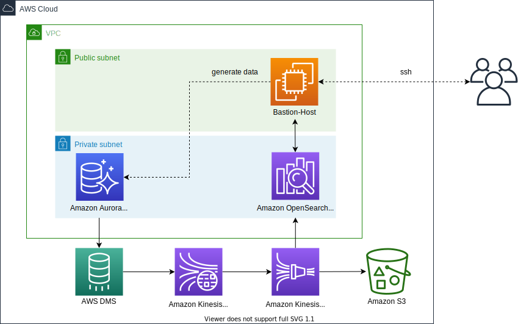
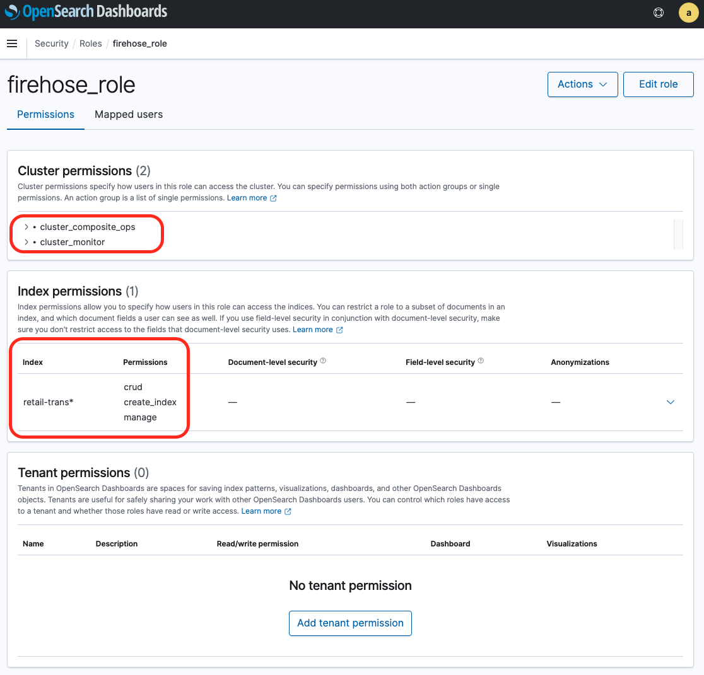
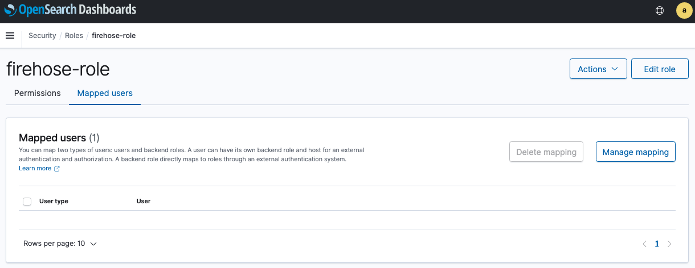
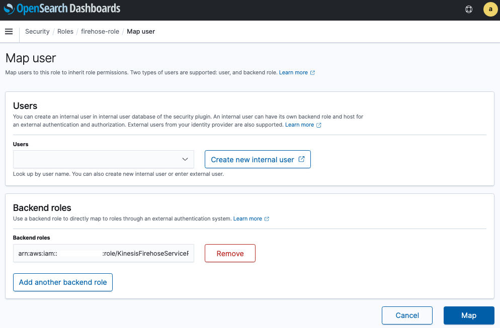

# Build Data Analytics using Amazon Data Migration Service(DMS)

This repository provides you cdk scripts and sample code on how to implement end to end data pipeline for replicating transactional data from MySQL DB to Amazon OpenSearch Service through Amazon Kinesis using Amazon Data Migration Service(DMS).

## Streaming Pipeline

Below diagram shows what we are implementing.



The `cdk.json` file tells the CDK Toolkit how to execute your app.

This project is set up like a standard Python project.  The initialization
process also creates a virtualenv within this project, stored under the `.venv`
directory.  To create the virtualenv it assumes that there is a `python3`
(or `python` for Windows) executable in your path with access to the `venv`
package. If for any reason the automatic creation of the virtualenv fails,
you can create the virtualenv manually.

To manually create a virtualenv on MacOS and Linux:

```
$ python3 -m venv .venv
```

After the init process completes and the virtualenv is created, you can use the following
step to activate your virtualenv.

```
$ source .venv/bin/activate
```

If you are a Windows platform, you would activate the virtualenv like this:

```
% .venv\Scripts\activate.bat
```

Once the virtualenv is activated, you can install the required dependencies.

```
(.venv) $ pip install -r requirements.txt
```

To add additional dependencies, for example other CDK libraries, just add
them to your `setup.py` file and rerun the `pip install -r requirements.txt`
command.


Before synthesizing the CloudFormation, you should set approperly the cdk context configuration file, `cdk.context.json`.

For example:
<pre>
{
  "db_cluster_name": "<i>db-cluster-name</i>",
  "db_secret_name": "<i>your-db-secret-name</i>",
  "dms_data_source": {
    "database_name": "<i>testdb</i>",
    "table_name": "<i>retail_trans</i>"
  },
  "kinesis_stream_name": "<i>your-dms-target-kinesis-stream-name</i>",
  "opensearch_domain_name": "<i>your-opensearch-domain-name</i>",
  "opensearch_index_name": "<i>your-opensearch-index-name</i>",
  "ec2_key_pair_name": "<i>your-ec2-key-pair-name(exclude .pem extension)</i>"
}
</pre>

:warning: `ec2_key_pair_name` option should be entered without the `.pem` extension.

Now you can now synthesize the CloudFormation template for this code.

## Creating Aurora MySQL cluster

1. :information_source: Create an AWS Secret for your RDS Admin user like this:
   <pre>
   (.venv) $ aws secretsmanager create-secret \
      --name "<i>your_db_secret_name</i>" \
      --description "<i>(Optional) description of the secret</i>" \
      --secret-string '{"username": "admin", "password": <i>"password_of_at_last_8_characters"</i>}'
   </pre>
   For example,
   <pre>
   (.venv) $ aws secretsmanager create-secret \
      --name "dev/rds/admin" \
      --description "admin user for rds" \
      --secret-string '{"username": "admin", "password": <i>"your admin password"</i>}'
   </pre>

2. Create an Aurora MySQL Cluster
   <pre>
   (.venv) $ cdk deploy VpcStack AuroraMysqlStack
   </pre>

## Confirm that binary logging is enabled

<b><em>In order to set up the Aurora MySQL, you need to connect the Aurora MySQL cluster on either your local PC or a EC2 instance.</em></b>

1. Connect to the Aurora cluster writer node.
   <pre>
    $ mysql -h<i>db-cluster-name</i>.cluster-<i>xxxxxxxxxxxx</i>.<i>region-name</i>.rds.amazonaws.com -uadmin -p
    Enter password: 
    Welcome to the MariaDB monitor.  Commands end with ; or \g.
    Your MySQL connection id is 20
    Server version: 8.0.23 Source distribution

    Copyright (c) 2000, 2018, Oracle, MariaDB Corporation Ab and others.

    Type 'help;' or '\h' for help. Type '\c' to clear the current input statement.

    MySQL [(none)]>
   </pre>

2. At SQL prompt run the below command to confirm that binary logging is enabled:
   <pre>
    MySQL [(none)]> SHOW GLOBAL VARIABLES LIKE "log_bin";
    +---------------+-------+
    | Variable_name | Value |
    +---------------+-------+
    | log_bin       | ON    |
    +---------------+-------+
    1 row in set (0.00 sec)
   </pre>

3. Also run this to AWS DMS has bin log access that is required for replication
   <pre>
    MySQL [(none)]> CALL mysql.rds_set_configuration('binlog retention hours', 24);
    Query OK, 0 rows affected (0.01 sec)
   </pre>

## Create a sample database and table

1. Run the below command to create the sample database named `testdb`.
   <pre>
    MySQL [(none)]> SHOW DATABASES;
    +--------------------+
    | Database           |
    +--------------------+
    | information_schema |
    | mysql              |
    | performance_schema |
    | sys                |
    +--------------------+
    4 rows in set (0.00 sec)

    MySQL [(none)]> CREATE DATABASE IF NOT EXISTS testdb;
    Query OK, 1 row affected (0.01 sec)

    MySQL [(none)]> USE testdb;
    Database changed
    MySQL [testdb]> SHOW TABLES;
    Empty set (0.00 sec)
   </pre>
2. Also run this to create the sample table named `retail_trans`
   <pre>
    MySQL [testdb]> CREATE TABLE IF NOT EXISTS testdb.retail_trans (
             trans_id BIGINT(20) AUTO_INCREMENT,
             customer_id VARCHAR(12) NOT NULL,
             event VARCHAR(10) DEFAULT NULL,
             sku VARCHAR(10) NOT NULL,
             amount INT DEFAULT 0,
             device VARCHAR(10) DEFAULT NULL,
             trans_datetime DATETIME DEFAULT CURRENT_TIMESTAMP,
             PRIMARY KEY(trans_id),
             KEY(trans_datetime)
           ) ENGINE=InnoDB AUTO_INCREMENT=0;
    Query OK, 0 rows affected, 1 warning (0.04 sec)

    MySQL [testdb]> SHOW TABLES;
    +------------------+
    | Tables_in_testdb |
    +------------------+
    | retail_trans     |
    +------------------+
    1 row in set (0.00 sec)

    MySQL [testdb]> DESC retail_trans;
    +----------------+-------------+------+-----+-------------------+-------------------+
    | Field          | Type        | Null | Key | Default           | Extra             |
    +----------------+-------------+------+-----+-------------------+-------------------+
    | trans_id       | bigint      | NO   | PRI | NULL              | auto_increment    |
    | customer_id    | varchar(12) | NO   |     | NULL              |                   |
    | event          | varchar(10) | YES  |     | NULL              |                   |
    | sku            | varchar(10) | NO   |     | NULL              |                   |
    | amount         | int         | YES  |     | 0                 |                   |
    | device         | varchar(10) | YES  |     | NULL              |                   |
    | trans_datetime | datetime    | YES  | MUL | CURRENT_TIMESTAMP | DEFAULT_GENERATED |
    +----------------+-------------+------+-----+-------------------+-------------------+
    7 rows in set (0.00 sec)

    MySQL [testdb]>    
   </pre>

<b><em>After setting up the Aurora MySQL, you should come back to the terminal where you are deploying stacks.</em></b>

## Create Amazon Kinesis Data Streams for AWS DMS target endpoint

  <pre>
  (.venv) $ cdk deploy DMSTargetKinesisDataStreamStack
  </pre>

## Create AWS DMS Replication Task
  For example, we already created the sample database (i.e. `testdb`) and table (`retail_trans`)
  <pre>
  (.venv) $ cdk deploy DMSAuroraMysqlToKinesisStack
  </pre>

## Create Amazon OpenSearch Service

  <pre>
  (.venv) $ cdk deploy OpenSearchStack
  </pre>

## Create Amazon Kinesis Data Firehose

  <pre>
  (.venv) $ cdk deploy FirehoseStack
  </pre>

## Remotely access your Amazon OpenSearch Cluster using SSH tunnel from local machine
#### Access to your Amazon OpenSearch Dashboards with web browser
1. To access the OpenSearch Cluster, add the ssh tunnel configuration to the ssh config file of the personal local PC as follows

    <pre>
    # OpenSearch Tunnel
    Host opstunnel
        HostName <i>EC2-Public-IP-of-Bastion-Host</i>
        User ec2-user
        IdentitiesOnly yes
        IdentityFile <i>Path-to-SSH-Public-Key</i>
        LocalForward 9200 <i>OpenSearch-Endpoint</i>:443
    </pre>

    ex)

    ```
    ~$ ls -1 .ssh/
    config
    my-ec2-key-pair.pem

    ~$ tail .ssh/config
    # OpenSearch Tunnel
    Host opstunnel
        HostName 214.132.71.219
        User ec2-user
        IdentitiesOnly yes
        IdentityFile ~/.ssh/my-ec2-key-pair.pem
        LocalForward 9200 vpc-search-domain-qvwlxanar255vswqna37p2l2cy.us-east-1.es.amazonaws.com:443

    ~$
    ```

    You can find the bastion host's public ip address as running the commands like this:

    <pre>
    $ BASTION_HOST_ID=$(aws cloudformation describe-stacks --stack-name <i>your-cloudformation-stack-name</i> | jq -r '.Stacks[0].Outputs | map(select(.OutputKey == "BastionHostBastionHostId")) | .[0].OutputValue')
    $ aws ec2 describe-instances --instance-ids ${BASTION_HOST_ID} | jq -r '.Reservations[0].Instances[0].PublicIpAddress'
    </pre>

2. Run `ssh -N opstunnel` in Terminal.
3. Connect to `https://localhost:9200/_dashboards/` in a web browser.
4. Enter the master user and password that you set up when you created the Amazon OpenSearch Service endpoint.
5. In the Welcome screen, click the toolbar icon to the left side of **Home** button. Choose **Stack Managerment**
   
6. After selecting **Advanced Settings** from the left sidebar menu, set **Timezone** for date formatting to `Etc/UTC`.
   Since the log creation time of the test data is based on UTC, OpenSearch Dashboard’s Timezone is also set to UTC.
   
7. If you would like to access the OpenSearch Cluster in a termial, open another terminal window, and then run the following commands: (in here, <i>`your-cloudformation-stack-name`</i> is `OpensearchStack`)

    <pre>
    $ MASTER_USER_SECRET_ID=$(aws cloudformation describe-stacks --stack-name <i>your-cloudformation-stack-name</i> | jq -r '.Stacks[0].Outputs | map(select(.OutputKey == "MasterUserSecretId")) | .[0].OutputValue')
    $ export OPS_SECRETS=$(aws secretsmanager get-secret-value --secret-id ${MASTER_USER_SECRET_ID} | jq -r '.SecretString | fromjson | "\(.username):\(.password)"')
    $ export OPS_DOMAIN=$(aws cloudformation describe-stacks --stack-name <i>your-cloudformation-stack-name</i> | jq -r '.Stacks[0].Outputs | map(select(.OutputKey == "OpenSearchDomainEndpoint")) | .[0].OutputValue')
    $ curl -XGET --insecure -u "${OPS_SECRETS}" https://localhost:9200/_cluster/health?pretty=true
    $ curl -XGET --insecure -u "${OPS_SECRETS}" https://localhost:9200/_cat/nodes?v
    $ curl -XGET --insecure -u "${OPS_SECRETS}" https://localhost:9200/_nodes/stats?pretty=true
    </pre>

#### Enable Kinesis Data Firehose to ingest records into Amazon OpenSearch
Kinesis Data Firehose uses the delivery role to sign HTTP (Signature Version 4) requests before sending the data to the Amazon OpenSearch Service endpoint.
You manage Amazon OpenSearch Service fine-grained access control permissions using roles, users, and mappings.
This section describes how to create roles and set permissions for Kinesis Data Firehose.

Complete the following steps:

1. Navigate to Kibana (you can find the URL on the Amazon OpenSearch Service console).
2. Enter the master user and password that you set up when you created the Amazon OpenSearch Service endpoint.
3. Under **Security**, choose **Roles**.
4. Choose **Create role**.
5. Name your role; for example, `firehose_role`.
6. For cluster permissions, add `cluster_composite_ops` and `cluster_monitor`.
7. Under **Index permissions**, choose **Index Patterns** and enter <i>index-name*</i>; for example, `retail-trans*`.
8. Under **Permissions**, add three action groups: `crud`, `create_index`, and `manage`.
9. Choose **Create**.
    

In the next step, you map the IAM role that Kinesis Data Firehose uses to the role you just created.

10. Choose the **Mapped users** tab.
    
11. Choose **Manage mapping** and under **Backend roles**,
12. For **Backend Roles**, enter the IAM ARN of the role Kinesis Data Firehose uses:
    `arn:aws:iam::123456789012:role/firehose_stream_role_name`.
    
13. Choose **Map**.

**Note**: After OpenSearch Role mapping for Kinesis Data Firehose, you would not be supposed to meet a data delivery failure with Kinesis Data Firehose like this:

<pre>
"errorMessage": "Error received from Elasticsearch cluster. {\"error\":{\"root_cause\":[{\"type\":\"security_exception\",\"reason\":\"no permissions for [indices:data/write/bulk] and User [name=arn:aws:iam::123456789012:role/KinesisFirehoseServiceRole-<i>firehose_stream_name</i>-<i>region_name</i>, backend_roles=[arn:aws:iam::123456789012:role/KinesisFirehoseServiceRole-<i>firehose_stream_name</i>-<i>region_name</i>], requestedTenant=null]\"}],\"type\":\"security_exception\",\"reason\":\"no permissions for [indices:data/write/bulk] and User [name=arn:aws:iam::123456789012:role/KinesisFirehoseServiceRole-<i>firehose_stream_name</i>-<i>region_name</i>, backend_roles=[arn:aws:iam::123456789012:role/KinesisFirehoseServiceRole-<i>firehose_stream_name</i>-<i>region_name</i>], requestedTenant=null]\"},\"status\":403}",
</pre>

## Run Test

1. Start the DMS Replication task by replacing the ARN in below command.
   <pre>
   (.venv) $ aws dms start-replication-task --replication-task-arn <i>dms-task-arn</i> --start-replication-task-type start-replication
   </pre>

2. Generate test data.
   <pre>
   (.venv) $ pip install -r utils/requirements-dev.txt
   (.venv) $ python utils/gen_fake_mysql_data.py \
                   --database <i>your-database-name</i> \
                   --table <i>your-table-name</i> \
                   --user <i>user-name</i> \
                   --password <i>password</i> \
                   --host <i>db-cluster-name</i>.cluster-<i>xxxxxxxxxxxx</i>.<i>region-name</i>.rds.amazonaws.com \
                   --max-count 200
   </pre>
   In the Data Viewer in the Amazon Kinesis Management Console, you can see incomming records.
   

3. Check the Amazon OpenSearch Discover Dashboard `5~10` minutes later, and you will see data ingested from the Aurora MySQL.<br/>
  For example,
   <pre>
   {
    "_index": "trans",
    "_type": "_doc",
    "_id": "49627593537354623426044597072248245532118434881168474130.0",
    "_version": 1,
    "_score": null,
    "_source": {
      "data": {
        "trans_id": 1274,
        "customer_id": "958474449243",
        "event": "purchase",
        "sku": "HM4387NUZL",
        "amount": 100,
        "device": "pc",
        "trans_datetime": "2022-03-14T14:17:40Z"
      },
      "metadata": {
        "timestamp": "2022-03-14T14:18:11.104009Z",
        "record-type": "data",
        "operation": "insert",
        "partition-key-type": "primary-key",
        "schema-name": "testdb",
        "table-name": "retail_trans",
        "transaction-id": 8590392498
      }
    },
    "fields": {
      "data.trans_datetime": [
        "2022-03-14T14:17:40.000Z"
      ],
      "metadata.timestamp": [
        "2022-03-14T14:18:11.104Z"
      ]
    },
    "sort": [
      1647267460000
    ]
   }
   </pre>

## Clean Up

1. Stop the DMS Replication task by replacing the ARN in below command.
   <pre>
   (.venv) $ aws dms stop-replication-task --replication-task-arn <i>dms-task-arn</i>
   </pre>

2. Delete the CloudFormation stack by running the below command.
   <pre>
   (.venv) $ cdk destroy --all
   </pre>

## Useful commands

 * `cdk ls`          list all stacks in the app
 * `cdk synth`       emits the synthesized CloudFormation template
 * `cdk deploy`      deploy this stack to your default AWS account/region
 * `cdk diff`        compare deployed stack with current state
 * `cdk docs`        open CDK documentation

Enjoy!

## References

 * [aws-dms-deployment-using-aws-cdk](https://github.com/aws-samples/aws-dms-deployment-using-aws-cdk) - AWS DMS deployment using AWS CDK (Python)
 * [aws-dms-msk-demo](https://github.com/aws-samples/aws-dms-msk-demo) - Streaming Data to Amazon MSK via AWS DMS
 * [How to troubleshoot binary logging errors that I received when using AWS DMS with Aurora MySQL as the source?(Last updated: 2019-10-01)](https://aws.amazon.com/premiumsupport/knowledge-center/dms-binary-logging-aurora-mysql/)
 * [AWS DMS - Using Amazon Kinesis Data Streams as a target for AWS Database Migration Service](https://docs.aws.amazon.com/dms/latest/userguide/CHAP_Target.Kinesis.html)
 * [Specifying task settings for AWS Database Migration Service tasks](https://docs.aws.amazon.com/dms/latest/userguide/CHAP_Tasks.CustomizingTasks.TaskSettings.html#CHAP_Tasks.CustomizingTasks.TaskSettings.Example)
 * [Windows SSH / Tunnel for Kibana Instructions - Amazon Elasticsearch Service](https://search-sa-log-solutions.s3-us-east-2.amazonaws.com/logstash/docs/Kibana_Proxy_SSH_Tunneling_Windows.pdf)
 * [Use an SSH Tunnel to access Kibana within an AWS VPC with PuTTy on Windows](https://amazonmsk-labs.workshop.aws/en/mskkdaflinklab/createesdashboard.html)
 * [OpenSearch Popular APIs](https://opensearch.org/docs/latest/opensearch/popular-api/)
 * [Using Data Viewer in the Kinesis Console](https://docs.aws.amazon.com/streams/latest/dev/data-viewer.html)

## Security

See [CONTRIBUTING](CONTRIBUTING.md#security-issue-notifications) for more information.

## License

This library is licensed under the MIT-0 License. See the LICENSE file.

